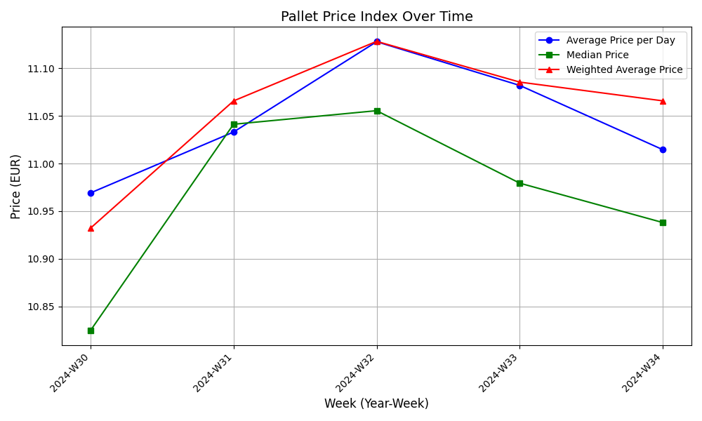

# Palett-Price-Index-Zerotrust-Blockchain
*This is a reference implementation for demonstration and academic purposes.*

This script processes a JSON file containing data, computes weekly statistics, generates zero-knowledge proofs (ZKPs) using the noknow library, 
and stores the results in a blockchain. It also verifies the integrity of the blockchain and logs all operations.
The script includes functions for hashing data, generating ZKPs, and creating a blockchain. 
It uses the pandas library to manipulate data and the hashlib library for hashing. 
The blockchain is stored in JSON files with timestamps to avoid overwriting previous versions. 
The script also includes error handling and logging for debugging purposes.   

Authors: Volker Engels | Thomas Hanke (at fom.de - mile Institut)

2025-04-24 Version 0.0.15 - Initial Version Reference Implementation 

https://github.com/FOM-mile-Institut/pallet_price_index_zero_trust_blockchain

Coresponding Author: Volker Engels (at fom.de)

## Install 

### Create Conda Virutal Environment

```bash 
conda create --name ppi python=3.12
conda activate ppi
```

### Install Python Modules with Pip 

```bash 
pip install -r requirements.txt
```

## Prepare 

### Before First Usage:
- Delete all old History Blockchain Files `blockchain*.*`

### Data History 
- Data in file `Index_data_example.json`
- Folowing Format :

```json 
{
  "id": "DE_ALL_V1",          // ID of the index
  "result": 89.25,            // Result of the index calculation
  "base": 12.23845,           // Base value of the index
  "date": "2024-09-01",       // Date of the index calculation
  "data": [                   // Array of data points
    [
      {
        "price": 10.8247,     // Price of the data point
        "amount": 660,        // Amount of the data point
        "zipcode": "31185",   // Zipcode of the data point
        "country": "Germany", // Country of the data point
        "date": "2024-08-01"  // Date of the data point
      },
      {
        "price": 11.1237,
        "amount": 660,
        "zipcode": "32758",
        "country": "Germany",
        "date": "2024-08-01"
      }
... 
    ]
  ]
}
``` 


## Usage 

Skript uses by default  `Index_data_example.json` file.

``` bash 
python pallet_price_index_zero_trust_blockchain.py 
``` 

### Output 

```bash
(ppi) C:\src\github\palettenpreisindex_zerotrust_blockchain>C:/Users/engels/.conda/envs/ppi/python.exe c:/src/github/palettenpreisindex_zerotrust_blockchain/pallet_price_index_zero_trust_blockchain.py
Block created for 2024-W30
Block created for 2024-W31
Block created for 2024-W32
Block created for 2024-W33
Block created for 2024-W34

Blockchain Integrity: Valid

Blockchain Contents:
Block #0:
  Timestamp: 2025-04-24 20:22:37
  Stats: None
  Data Hash: ...
  Proof: ...
  Signature: ...
  Previous Hash: 0...
  Hash: 00000088c78b0192...

Block #1:
  Timestamp: 2025-04-24 20:22:37
  Stats: {'year_week': '2024-W30', 'total_amount': 4338, 'datapoint_count': 7, 'avg_price_per_day': 10.969113888333332}
  Data Hash: 257decd6a880ab61...
  Proof: eyJwYXJhbXMiOnsi...
  Signature: eyJwYXJhbXMiOnsi...
  Previous Hash: 00000088c78b0192...
  Hash: 00000908c18b6d65...

Block #2:
  Timestamp: 2025-04-24 20:22:39
  Stats: {'year_week': '2024-W31', 'total_amount': 15540, 'datapoint_count': 19, 'avg_price_per_day': 11.033045714285715}
  Data Hash: 15142c5474190ab1...
  Proof: eyJwYXJhbXMiOnsi...
  Signature: eyJwYXJhbXMiOnsi...
  Previous Hash: 00000908c18b6d65...
  Hash: 0000bf228663c251...

Block #3:
  Timestamp: 2025-04-24 20:22:40
  Stats: {'year_week': '2024-W32', 'total_amount': 32420, 'datapoint_count': 38, 'avg_price_per_day': 11.12782173892774}
  Data Hash: 6b6ac31471afde28...
  Proof: eyJwYXJhbXMiOnsi...
  Signature: eyJwYXJhbXMiOnsi...
  Previous Hash: 0000bf228663c251...
  Hash: 0000b230e60a6206...

Block #4:
  Timestamp: 2025-04-24 20:22:40
  Stats: {'year_week': '2024-W33', 'total_amount': 21826, 'datapoint_count': 33, 'avg_price_per_day': 11.081956883394383}
  Data Hash: 563d86dabe3b61f2...
  Proof: eyJwYXJhbXMiOnsi...
  Signature: eyJwYXJhbXMiOnsi...
  Previous Hash: 0000b230e60a6206...
  Hash: 0000c61becbd897d...

Block #5:
  Timestamp: 2025-04-24 20:22:41
  Stats: {'year_week': '2024-W34', 'total_amount': 31760, 'datapoint_count': 48, 'avg_price_per_day': 11.014537879084967}
  Data Hash: 2949284dba3cb088...
  Proof: eyJwYXJhbXMiOnsi...
  Signature: eyJwYXJhbXMiOnsi...
  Previous Hash: 0000c61becbd897d...
  Hash: 00001a9445ad1d77...
```

### audit_log.txt
```log
[2025-04-24 20:22:37] Block #0 created: Data Hash=, Stats=None
[2025-04-24 20:22:39] Block #1 created: Data Hash=257decd6a880ab61e0f37d95f4422d1a6e3500cbc11359338316edd246b95479, Stats={'year_week': '2024-W30', 'total_amount': 4338, 'datapoint_count': 7, 'avg_price_per_day': 10.969113888333332}
[2025-04-24 20:22:40] Block #2 created: Data Hash=15142c5474190ab140b6d403d683a894aedd41f8d9ef28c791400906eb4125ad, Stats={'year_week': '2024-W31', 'total_amount': 15540, 'datapoint_count': 19, 'avg_price_per_day': 11.033045714285715}
[2025-04-24 20:22:40] Block #3 created: Data Hash=6b6ac31471afde28a1a693004b31ec752a4c5ea84d9236dc78149a44f547c330, Stats={'year_week': '2024-W32', 'total_amount': 32420, 'datapoint_count': 38, 'avg_price_per_day': 11.12782173892774}
[2025-04-24 20:22:41] Block #4 created: Data Hash=563d86dabe3b61f25b085c4cb25449e83426837b4388bd49d0d5038c404fe077, Stats={'year_week': '2024-W33', 'total_amount': 21826, 'datapoint_count': 33, 'avg_price_per_day': 11.081956883394383}
[2025-04-24 20:22:41] Block #5 created: Data Hash=2949284dba3cb088ead7d0123689030a3a492743cc570429733e97585c5865f9, Stats={'year_week': '2024-W34', 'total_amount': 31760, 'datapoint_count': 48, 'avg_price_per_day': 11.014537879084967}

```

### Blockchain.log

```log

2025-04-24 20:22:37,312 - INFO - Saved blockchain to blockchain_20250424_202237.json
2025-04-24 20:22:37,313 - INFO - Created block #0 for stats: None
2025-04-24 20:22:37,313 - INFO - Created genesis block
2025-04-24 20:22:37,321 - DEBUG - Generated ZKP signature for secret: 4338_7_10.969113888333332
2025-04-24 20:22:37,327 - DEBUG - Generated ZKP proof for 2024-W30 with data_hash: 257decd6a880ab61e0f37d95f4422d1a6e3500cbc11359338316edd246b95479
2025-04-24 20:22:37,327 - DEBUG - Block #1 proof: eyJwYXJhbXMiOnsiYWxnIjoic2hhM18yNTYiLCJjdXJ2ZSI6InNlY3AyNTZrMSIsInMiOjY3MDg0MjgyNTY5MTA3ODA5OTQyNjc3MTI4ODQ2NDQ1NzkxMTQxMDc5OTcwMzQyODQ1MDk1NDc4OTY0MjM0NjAwMjA4MTIwODc2MTUzfSwiYyI6MTMzMjc3NDA5NzAwMjA1NTY0NDE4ODQwNTkxODE3MDYzNjM0NjUyNzkwMjQ1MzQ4MzM4OTY0ODg3NTExODYwMDMzNjU2NzQ4OTg1NjEsIm0iOjc1MDY2NjY0NjYwMDIwNjQ3MTI3NjIwMzcwNTgzNzM4NDU3NDMxMTU4OTE0NjM4ODY4MjM0ODMwMjU0Mzg1NTk4MzM0MTI5NjgwNTA1OTgwODg0MTA2MjA2MzI2MjMwNTM3MDMzMjI2MDU5NjI3MjAyNDQxNTk0Mjc4OTc1MTkzMTk3OTc5MjM2MjQwNjY0ODQyNzkxNjA5M30=
2025-04-24 20:22:37,327 - DEBUG - Block #1 signature: eyJwYXJhbXMiOnsiYWxnIjoic2hhM18yNTYiLCJjdXJ2ZSI6InNlY3AyNTZrMSIsInMiOjY3MDg0MjgyNTY5MTA3ODA5OTQyNjc3MTI4ODQ2NDQ1NzkxMTQxMDc5OTcwMzQyODQ1MDk1NDc4OTY0MjM0NjAwMjA4MTIwODc2MTUzfSwic2lnbmF0dXJlIjo2MjcwOTg3MjIzMDc1OTA2ODQ3Mjc5NDE4OTQ3Njc3OTEzOTYxODI0OTg3NjQwMjU1ODgyNzgyMTcyMjA2NjkwNjAwMDg3ODkwMTA4NDkwNDU1ODk0MTAxODUzMTM4Mjk3NDUzNDA2MDI2NzQ0NTQ5NTE0MDk3OTg3OTcxMTc2OTEzOTg1MDAxODc2MjczMTM3MDIwODg2MTQ4MX0=
2025-04-24 20:22:39,905 - INFO - Saved blockchain to blockchain_20250424_202239.json
2025-04-24 20:22:39,905 - INFO - Created block #1 for stats: {'year_week': '2024-W30', 'total_amount': 4338, 'datapoint_count': 7, 'avg_price_per_day': 10.969113888333332}
2025-04-24 20:22:39,914 - DEBUG - Generated ZKP signature for secret: 15540_19_11.033045714285715
2025-04-24 20:22:39,919 - DEBUG - Generated ZKP proof for 2024-W31 with data_hash: 15142c5474190ab140b6d403d683a894aedd41f8d9ef28c791400906eb4125ad
2025-04-24 20:22:39,919 - DEBUG - Block #2 proof: eyJwYXJhbXMiOnsiYWxnIjoic2hhM18yNTYiLCJjdXJ2ZSI6InNlY3AyNTZrMSIsInMiOjM3MjM4ODM3Nzg0OTcwOTgwMzg5OTg2NDM5MDI1MTQ0NzI1NjE5NjA1NzcyNDE0Nzk0Mjg3MTU5MTc2NjgwMjU0NTg3Mjg4ODI0ODU0fSwiYyI6Njk3NDMxMTU2OTc4MDkxOTY5MTg2MTMzMDYxNzk0NzA2MDA4MzU5NzA4NTUwNjg3MzQxNjI1NDc2ODY3MzAxNDYyMDM1NjY2MzEwNDksIm0iOjIzNDM5MzE4NzUxMjE4MTg1NDIxMjYyMzAwMjU5NTkyNDkyMTU1ODE5NzA5NzIxODUzMDI2OTU5MjU0NDg2NDg5MDcyNzc1NzkwMDAyNDg2MjA2NzE0NjczMjQ1NzA2Mzg2MTI5NzU0NzI1MDM5NTQ4MDc3MDQzMTI5NjA3MzI5NjkzOTY3MzQ2NzMxNjA2MjY3NTMwNDI3MH0=
2025-04-24 20:22:39,919 - DEBUG - Block #2 signature: eyJwYXJhbXMiOnsiYWxnIjoic2hhM18yNTYiLCJjdXJ2ZSI6InNlY3AyNTZrMSIsInMiOjM3MjM4ODM3Nzg0OTcwOTgwMzg5OTg2NDM5MDI1MTQ0NzI1NjE5NjA1NzcyNDE0Nzk0Mjg3MTU5MTc2NjgwMjU0NTg3Mjg4ODI0ODU0fSwic2lnbmF0dXJlIjo2MjkyNjAyNzA4MzkyNzg1NDM5OTAwMDI1MDcwNjIyOTEyMDkxMzExMzM2MDcxMDI1MTg5NzI0OTc0NTg3MzU1MjU3NTcwNDk2NTk0MzIzNjc1ODMxODU1MzI0NDk4ODY0ODM1OTcwNzc1OTQxODAwMjMwNTg4OTMxOTg0MjU0MDYyNDMzMzQ0NTU1OTAwNDUzMzI4NjUzNjc1MX0=
2025-04-24 20:22:40,315 - INFO - Saved blockchain to blockchain_20250424_202240.json
2025-04-24 20:22:40,315 - INFO - Created block #2 for stats: {'year_week': '2024-W31', 'total_amount': 15540, 'datapoint_count': 19, 'avg_price_per_day': 11.033045714285715}
2025-04-24 20:22:40,324 - DEBUG - Generated ZKP signature for secret: 32420_38_11.12782173892774
2025-04-24 20:22:40,328 - DEBUG - Generated ZKP proof for 2024-W32 with data_hash: 6b6ac31471afde28a1a693004b31ec752a4c5ea84d9236dc78149a44f547c330
2025-04-24 20:22:40,328 - DEBUG - Block #3 proof: eyJwYXJhbXMiOnsiYWxnIjoic2hhM18yNTYiLCJjdXJ2ZSI6InNlY3AyNTZrMSIsInMiOjEyNjg2NjcwODcyODE2MTMyMTkzMDQ1OTA2NDkyMTYwOTE5ODgyNjY0NTA0MTcyNTE3ODg1Nzk0NjYyMjkzMTcyMDMxMDQxODc1MTI5fSwiYyI6NDM5MzgyMjc5Nzc1NDg1MTk4MjM0MzA4OTg0NDc4Mjg1OTcxMjkxMDk5MDE1MzIzODA0NzU2NTIxNzMwMDI3NTk2ODg2MzAyNzEyNzUsIm0iOjMxNjU0NDA3MjI3MDExNTQyNzQzNzAwMjI3OTIyOTkwMTMxODU0NzQyMTcwODA0MzEzMzMyODc1NDI1Mzk1NjA5NzgzNzk1NzYwMDg0MDk3MTIyNjI5NzcwMTgzNTQ2Mjk0ODY1MzQ4Mjk5Njg0NjU4MDMzODEzNTM4OTAyMDE2MDk3NDExNDg4MzE2NTY5ODA0NTg0MzI3MTR9
2025-04-24 20:22:40,328 - DEBUG - Block #3 signature: eyJwYXJhbXMiOnsiYWxnIjoic2hhM18yNTYiLCJjdXJ2ZSI6InNlY3AyNTZrMSIsInMiOjEyNjg2NjcwODcyODE2MTMyMTkzMDQ1OTA2NDkyMTYwOTE5ODgyNjY0NTA0MTcyNTE3ODg1Nzk0NjYyMjkzMTcyMDMxMDQxODc1MTI5fSwic2lnbmF0dXJlIjo1NjYyNjE3NDAyMjk3MjgyOTA3NDU2MTI2MTMxNTYwODY0MzYxNTE4NjM5NjE3ODE3MjcwODUzMzg3ODMzMTUwMzMzODIzNjY2NDQ5ODUyMDE2NzE1NzA5OTgyNTI3MzM3NzQ1Nzg5NjAwMzQ1NDM4NDMwMDU3NDgwNzUwMTEzNTQ1NTU5MDAwOTE3NTYwMDE3MjE5NDE4MjEzMX0=
2025-04-24 20:22:40,860 - INFO - Saved blockchain to blockchain_20250424_202240.json
2025-04-24 20:22:40,861 - INFO - Created block #3 for stats: {'year_week': '2024-W32', 'total_amount': 32420, 'datapoint_count': 38, 'avg_price_per_day': 11.12782173892774}
2025-04-24 20:22:40,869 - DEBUG - Generated ZKP signature for secret: 21826_33_11.081956883394383
2025-04-24 20:22:40,874 - DEBUG - Generated ZKP proof for 2024-W33 with data_hash: 563d86dabe3b61f25b085c4cb25449e83426837b4388bd49d0d5038c404fe077
2025-04-24 20:22:40,874 - DEBUG - Block #4 proof: eyJwYXJhbXMiOnsiYWxnIjoic2hhM18yNTYiLCJjdXJ2ZSI6InNlY3AyNTZrMSIsInMiOjk0OTM5OTAzNTAwNzcxMTcyMDQwODI3ODY0MjQ2ODY4MzYxMTQxOTU4Nzg2NTMxMzA0MTk4MzM3NjgyODYxMDk0MDY2NTY2MjM2MDUzfSwiYyI6NDU2Mjk5MTYzNTUzNzk3NjkwMzAxNzQyNjg3Nzc4NDI5NDE2NDQ0NDk4MzYzNzI1MjExMjc2NTcwOTM1NTU4MDkxMTI5NDY1Njk2NzIsIm0iOjM4Njg4NDY5NzA3Nzg3OTM2MjgxMzYzMTkwNjA2MTc1ODkxODAyNTY3MjI0MjY1NDQwNDM5MDYyNjA2ODAyMDYwMzI5ODUyNzAzNzc0OTIzMTcyODQ4ODM3MTE1Mjc3OTI2MzA1NDY3Mzc4Nzc3NjA5ODM2MTAyMzQzODI5MzAyOTkxODUxODIzNzUxNTA1MTc0MDEzNDM3MTN9
2025-04-24 20:22:40,874 - DEBUG - Block #4 signature: eyJwYXJhbXMiOnsiYWxnIjoic2hhM18yNTYiLCJjdXJ2ZSI6InNlY3AyNTZrMSIsInMiOjk0OTM5OTAzNTAwNzcxMTcyMDQwODI3ODY0MjQ2ODY4MzYxMTQxOTU4Nzg2NTMxMzA0MTk4MzM3NjgyODYxMDk0MDY2NTY2MjM2MDUzfSwic2lnbmF0dXJlIjo2NDQ1ODEzNzUxOTA3MDMyNTk3MDU0Nzg2MTQzNjczMzY1NTMyOTAzODY4OTAzODkyNDM5MDMwMzQ4Nzg3MTQ5MjU5OTUxNDMwMjk2NDc1MjgzNzU0NTkzMjE5MTUxNDE4NzE0MTM4NzUwNzQwNzYzNzQyOTQyNjAzODA2NzczMzg0MDI1MDQ3OTIwNjI0MTIzNzUxMzk1MzczMH0=
2025-04-24 20:22:41,279 - INFO - Saved blockchain to blockchain_20250424_202241.json
2025-04-24 20:22:41,279 - INFO - Created block #4 for stats: {'year_week': '2024-W33', 'total_amount': 21826, 'datapoint_count': 33, 'avg_price_per_day': 11.081956883394383}
2025-04-24 20:22:41,287 - DEBUG - Generated ZKP signature for secret: 31760_48_11.014537879084967
2025-04-24 20:22:41,293 - DEBUG - Generated ZKP proof for 2024-W34 with data_hash: 2949284dba3cb088ead7d0123689030a3a492743cc570429733e97585c5865f9
2025-04-24 20:22:41,293 - DEBUG - Block #5 proof: eyJwYXJhbXMiOnsiYWxnIjoic2hhM18yNTYiLCJjdXJ2ZSI6InNlY3AyNTZrMSIsInMiOjQwNDQwODUwNTcyODg0ODQ2OTczNzU0OTg1NzUwMDQxMTk5NTg5MjIyMzgyMjcwNzc0MDQ2MzM0MDM1OTkxNTAxMzk4ODA5OTYzNjAwfSwiYyI6ODI2NTYzNzQ5MjUyOTcyNDY5NDgzNTk0MjgxMTgzNDIxOTE0NDE1MTUyNjA2OTk5ODA1NTM3MTk5OTM3OTY2ODc1MzIxODg5NzUzMzUsIm0iOjk0MTQ5NTk3MjEzNzcyMTIwMjg1MTgyNDM0MjYwOTQ5ODcyODAwOTkyOTY5OTI5NzQwMTQ1NzQxNzYxNTQ0MTg5NjA4OTMyMTQ1NjIyMzExMDMyNDgwMjA1NzkxOTM2Nzk4NzM3OTYzODY1NDA3NDgwNTM3OTI0NTI3MzQyOTA3NjMxMTQ5MzM0NTU0MjcxNTU3OTAyNTY0NX0=
2025-04-24 20:22:41,293 - DEBUG - Block #5 signature: eyJwYXJhbXMiOnsiYWxnIjoic2hhM18yNTYiLCJjdXJ2ZSI6InNlY3AyNTZrMSIsInMiOjQwNDQwODUwNTcyODg0ODQ2OTczNzU0OTg1NzUwMDQxMTk5NTg5MjIyMzgyMjcwNzc0MDQ2MzM0MDM1OTkxNTAxMzk4ODA5OTYzNjAwfSwic2lnbmF0dXJlIjo1NzAxNTU4ODU4MTU5MjQwMjY1NTU2NTU5MzMxNTUwNDA0NjUxMTAyNjcxOTMyOTgyMzc5MTY4OTY2ODU5MjY3OTk1NTIzNTc0MTQ0Mzk1ODY0MzI2OTgxNjYyMDk0NzUzODg5MDExOTg5MzM0NTkyMjQ3NDgwODkzNzM3Mzg3NzkyNjAxMTUwNzMxODkzNjMwNjY2NDIzNzAzNH0=
2025-04-24 20:22:41,743 - INFO - Saved blockchain to blockchain_20250424_202241.json
2025-04-24 20:22:41,744 - INFO - Created block #5 for stats: {'year_week': '2024-W34', 'total_amount': 31760, 'datapoint_count': 48, 'avg_price_per_day': 11.014537879084967}
2025-04-24 20:22:41,744 - DEBUG - Block #0 passed verification
2025-04-24 20:22:41,744 - DEBUG - Verifying block #1 signature: eyJwYXJhbXMiOnsiYWxnIjoic2hhM18yNTYiLCJjdXJ2ZSI6InNlY3AyNTZrMSIsInMiOjY3MDg0MjgyNTY5MTA3ODA5OTQyNjc3MTI4ODQ2NDQ1NzkxMTQxMDc5OTcwMzQyODQ1MDk1NDc4OTY0MjM0NjAwMjA4MTIwODc2MTUzfSwic2lnbmF0dXJlIjo2MjcwOTg3MjIzMDc1OTA2ODQ3Mjc5NDE4OTQ3Njc3OTEzOTYxODI0OTg3NjQwMjU1ODgyNzgyMTcyMjA2NjkwNjAwMDg3ODkwMTA4NDkwNDU1ODk0MTAxODUzMTM4Mjk3NDUzNDA2MDI2NzQ0NTQ5NTE0MDk3OTg3OTcxMTc2OTEzOTg1MDAxODc2MjczMTM3MDIwODg2MTQ4MX0=
2025-04-24 20:22:41,744 - DEBUG - Verifying block #1 proof: eyJwYXJhbXMiOnsiYWxnIjoic2hhM18yNTYiLCJjdXJ2ZSI6InNlY3AyNTZrMSIsInMiOjY3MDg0MjgyNTY5MTA3ODA5OTQyNjc3MTI4ODQ2NDQ1NzkxMTQxMDc5OTcwMzQyODQ1MDk1NDc4OTY0MjM0NjAwMjA4MTIwODc2MTUzfSwiYyI6MTMzMjc3NDA5NzAwMjA1NTY0NDE4ODQwNTkxODE3MDYzNjM0NjUyNzkwMjQ1MzQ4MzM4OTY0ODg3NTExODYwMDMzNjU2NzQ4OTg1NjEsIm0iOjc1MDY2NjY0NjYwMDIwNjQ3MTI3NjIwMzcwNTgzNzM4NDU3NDMxMTU4OTE0NjM4ODY4MjM0ODMwMjU0Mzg1NTk4MzM0MTI5NjgwNTA1OTgwODg0MTA2MjA2MzI2MjMwNTM3MDMzMjI2MDU5NjI3MjAyNDQxNTk0Mjc4OTc1MTkzMTk3OTc5MjM2MjQwNjY0ODQyNzkxNjA5M30=
2025-04-24 20:22:41,744 - DEBUG - Block #1 ZKData: ZKData(data='257decd6a880ab61e0f37d95f4422d1a6e3500cbc11359338316edd246b95479', proof=ZKProof(params=ZKParameters(alg='sha3_256', curve='secp256k1', s=67084282569107809942677128846445791141079970342845095478964234600208120876153), c=13327740970020556441884059181706363465279024534833896488751186003365674898561, m=750666646600206471276203705837384574311589146388682348302543855983341296805059808841062063262305370332260596272024415942789751931979792362406648427916093))
2025-04-24 20:22:41,752 - DEBUG - Block #1 ZKP verification: True
2025-04-24 20:22:41,752 - DEBUG - Block #1 passed verification
2025-04-24 20:22:41,752 - DEBUG - Verifying block #2 signature: eyJwYXJhbXMiOnsiYWxnIjoic2hhM18yNTYiLCJjdXJ2ZSI6InNlY3AyNTZrMSIsInMiOjM3MjM4ODM3Nzg0OTcwOTgwMzg5OTg2NDM5MDI1MTQ0NzI1NjE5NjA1NzcyNDE0Nzk0Mjg3MTU5MTc2NjgwMjU0NTg3Mjg4ODI0ODU0fSwic2lnbmF0dXJlIjo2MjkyNjAyNzA4MzkyNzg1NDM5OTAwMDI1MDcwNjIyOTEyMDkxMzExMzM2MDcxMDI1MTg5NzI0OTc0NTg3MzU1MjU3NTcwNDk2NTk0MzIzNjc1ODMxODU1MzI0NDk4ODY0ODM1OTcwNzc1OTQxODAwMjMwNTg4OTMxOTg0MjU0MDYyNDMzMzQ0NTU1OTAwNDUzMzI4NjUzNjc1MX0=
2025-04-24 20:22:41,752 - DEBUG - Verifying block #2 proof: eyJwYXJhbXMiOnsiYWxnIjoic2hhM18yNTYiLCJjdXJ2ZSI6InNlY3AyNTZrMSIsInMiOjM3MjM4ODM3Nzg0OTcwOTgwMzg5OTg2NDM5MDI1MTQ0NzI1NjE5NjA1NzcyNDE0Nzk0Mjg3MTU5MTc2NjgwMjU0NTg3Mjg4ODI0ODU0fSwiYyI6Njk3NDMxMTU2OTc4MDkxOTY5MTg2MTMzMDYxNzk0NzA2MDA4MzU5NzA4NTUwNjg3MzQxNjI1NDc2ODY3MzAxNDYyMDM1NjY2MzEwNDksIm0iOjIzNDM5MzE4NzUxMjE4MTg1NDIxMjYyMzAwMjU5NTkyNDkyMTU1ODE5NzA5NzIxODUzMDI2OTU5MjU0NDg2NDg5MDcyNzc1NzkwMDAyNDg2MjA2NzE0NjczMjQ1NzA2Mzg2MTI5NzU0NzI1MDM5NTQ4MDc3MDQzMTI5NjA3MzI5NjkzOTY3MzQ2NzMxNjA2MjY3NTMwNDI3MH0=
2025-04-24 20:22:41,752 - DEBUG - Block #2 ZKData: ZKData(data='15142c5474190ab140b6d403d683a894aedd41f8d9ef28c791400906eb4125ad', proof=ZKProof(params=ZKParameters(alg='sha3_256', curve='secp256k1', s=37238837784970980389986439025144725619605772414794287159176680254587288824854), c=69743115697809196918613306179470600835970855068734162547686730146203566631049, m=234393187512181854212623002595924921558197097218530269592544864890727757900024862067146732457063861297547250395480770431296073296939673467316062675304270))
2025-04-24 20:22:41,759 - DEBUG - Block #2 ZKP verification: True
2025-04-24 20:22:41,760 - DEBUG - Block #2 passed verification
2025-04-24 20:22:41,760 - DEBUG - Verifying block #3 signature: eyJwYXJhbXMiOnsiYWxnIjoic2hhM18yNTYiLCJjdXJ2ZSI6InNlY3AyNTZrMSIsInMiOjEyNjg2NjcwODcyODE2MTMyMTkzMDQ1OTA2NDkyMTYwOTE5ODgyNjY0NTA0MTcyNTE3ODg1Nzk0NjYyMjkzMTcyMDMxMDQxODc1MTI5fSwic2lnbmF0dXJlIjo1NjYyNjE3NDAyMjk3MjgyOTA3NDU2MTI2MTMxNTYwODY0MzYxNTE4NjM5NjE3ODE3MjcwODUzMzg3ODMzMTUwMzMzODIzNjY2NDQ5ODUyMDE2NzE1NzA5OTgyNTI3MzM3NzQ1Nzg5NjAwMzQ1NDM4NDMwMDU3NDgwNzUwMTEzNTQ1NTU5MDAwOTE3NTYwMDE3MjE5NDE4MjEzMX0=
2025-04-24 20:22:41,760 - DEBUG - Verifying block #3 proof: eyJwYXJhbXMiOnsiYWxnIjoic2hhM18yNTYiLCJjdXJ2ZSI6InNlY3AyNTZrMSIsInMiOjEyNjg2NjcwODcyODE2MTMyMTkzMDQ1OTA2NDkyMTYwOTE5ODgyNjY0NTA0MTcyNTE3ODg1Nzk0NjYyMjkzMTcyMDMxMDQxODc1MTI5fSwiYyI6NDM5MzgyMjc5Nzc1NDg1MTk4MjM0MzA4OTg0NDc4Mjg1OTcxMjkxMDk5MDE1MzIzODA0NzU2NTIxNzMwMDI3NTk2ODg2MzAyNzEyNzUsIm0iOjMxNjU0NDA3MjI3MDExNTQyNzQzNzAwMjI3OTIyOTkwMTMxODU0NzQyMTcwODA0MzEzMzMyODc1NDI1Mzk1NjA5NzgzNzk1NzYwMDg0MDk3MTIyNjI5NzcwMTgzNTQ2Mjk0ODY1MzQ4Mjk5Njg0NjU4MDMzODEzNTM4OTAyMDE2MDk3NDExNDg4MzE2NTY5ODA0NTg0MzI3MTR9
2025-04-24 20:22:41,760 - DEBUG - Block #3 ZKData: ZKData(data='6b6ac31471afde28a1a693004b31ec752a4c5ea84d9236dc78149a44f547c330', proof=ZKProof(params=ZKParameters(alg='sha3_256', curve='secp256k1', s=12686670872816132193045906492160919882664504172517885794662293172031041875129), c=43938227977548519823430898447828597129109901532380475652173002759688630271275, m=3165440722701154274370022792299013185474217080431333287542539560978379576008409712262977018354629486534829968465803381353890201609741148831656980458432714))
2025-04-24 20:22:41,768 - DEBUG - Block #3 ZKP verification: True
2025-04-24 20:22:41,768 - DEBUG - Block #3 passed verification
2025-04-24 20:22:41,768 - DEBUG - Verifying block #4 signature: eyJwYXJhbXMiOnsiYWxnIjoic2hhM18yNTYiLCJjdXJ2ZSI6InNlY3AyNTZrMSIsInMiOjk0OTM5OTAzNTAwNzcxMTcyMDQwODI3ODY0MjQ2ODY4MzYxMTQxOTU4Nzg2NTMxMzA0MTk4MzM3NjgyODYxMDk0MDY2NTY2MjM2MDUzfSwic2lnbmF0dXJlIjo2NDQ1ODEzNzUxOTA3MDMyNTk3MDU0Nzg2MTQzNjczMzY1NTMyOTAzODY4OTAzODkyNDM5MDMwMzQ4Nzg3MTQ5MjU5OTUxNDMwMjk2NDc1MjgzNzU0NTkzMjE5MTUxNDE4NzE0MTM4NzUwNzQwNzYzNzQyOTQyNjAzODA2NzczMzg0MDI1MDQ3OTIwNjI0MTIzNzUxMzk1MzczMH0=
2025-04-24 20:22:41,768 - DEBUG - Verifying block #4 proof: eyJwYXJhbXMiOnsiYWxnIjoic2hhM18yNTYiLCJjdXJ2ZSI6InNlY3AyNTZrMSIsInMiOjk0OTM5OTAzNTAwNzcxMTcyMDQwODI3ODY0MjQ2ODY4MzYxMTQxOTU4Nzg2NTMxMzA0MTk4MzM3NjgyODYxMDk0MDY2NTY2MjM2MDUzfSwiYyI6NDU2Mjk5MTYzNTUzNzk3NjkwMzAxNzQyNjg3Nzc4NDI5NDE2NDQ0NDk4MzYzNzI1MjExMjc2NTcwOTM1NTU4MDkxMTI5NDY1Njk2NzIsIm0iOjM4Njg4NDY5NzA3Nzg3OTM2MjgxMzYzMTkwNjA2MTc1ODkxODAyNTY3MjI0MjY1NDQwNDM5MDYyNjA2ODAyMDYwMzI5ODUyNzAzNzc0OTIzMTcyODQ4ODM3MTE1Mjc3OTI2MzA1NDY3Mzc4Nzc3NjA5ODM2MTAyMzQzODI5MzAyOTkxODUxODIzNzUxNTA1MTc0MDEzNDM3MTN9
2025-04-24 20:22:41,768 - DEBUG - Block #4 ZKData: ZKData(data='563d86dabe3b61f25b085c4cb25449e83426837b4388bd49d0d5038c404fe077', proof=ZKProof(params=ZKParameters(alg='sha3_256', curve='secp256k1', s=94939903500771172040827864246868361141958786531304198337682861094066566236053), c=45629916355379769030174268777842941644449836372521127657093555809112946569672, m=3868846970778793628136319060617589180256722426544043906260680206032985270377492317284883711527792630546737877760983610234382930299185182375150517401343713))
2025-04-24 20:22:41,777 - DEBUG - Block #4 ZKP verification: True
2025-04-24 20:22:41,777 - DEBUG - Block #4 passed verification
2025-04-24 20:22:41,777 - DEBUG - Verifying block #5 signature: eyJwYXJhbXMiOnsiYWxnIjoic2hhM18yNTYiLCJjdXJ2ZSI6InNlY3AyNTZrMSIsInMiOjQwNDQwODUwNTcyODg0ODQ2OTczNzU0OTg1NzUwMDQxMTk5NTg5MjIyMzgyMjcwNzc0MDQ2MzM0MDM1OTkxNTAxMzk4ODA5OTYzNjAwfSwic2lnbmF0dXJlIjo1NzAxNTU4ODU4MTU5MjQwMjY1NTU2NTU5MzMxNTUwNDA0NjUxMTAyNjcxOTMyOTgyMzc5MTY4OTY2ODU5MjY3OTk1NTIzNTc0MTQ0Mzk1ODY0MzI2OTgxNjYyMDk0NzUzODg5MDExOTg5MzM0NTkyMjQ3NDgwODkzNzM3Mzg3NzkyNjAxMTUwNzMxODkzNjMwNjY2NDIzNzAzNH0=
2025-04-24 20:22:41,777 - DEBUG - Verifying block #5 proof: eyJwYXJhbXMiOnsiYWxnIjoic2hhM18yNTYiLCJjdXJ2ZSI6InNlY3AyNTZrMSIsInMiOjQwNDQwODUwNTcyODg0ODQ2OTczNzU0OTg1NzUwMDQxMTk5NTg5MjIyMzgyMjcwNzc0MDQ2MzM0MDM1OTkxNTAxMzk4ODA5OTYzNjAwfSwiYyI6ODI2NTYzNzQ5MjUyOTcyNDY5NDgzNTk0MjgxMTgzNDIxOTE0NDE1MTUyNjA2OTk5ODA1NTM3MTk5OTM3OTY2ODc1MzIxODg5NzUzMzUsIm0iOjk0MTQ5NTk3MjEzNzcyMTIwMjg1MTgyNDM0MjYwOTQ5ODcyODAwOTkyOTY5OTI5NzQwMTQ1NzQxNzYxNTQ0MTg5NjA4OTMyMTQ1NjIyMzExMDMyNDgwMjA1NzkxOTM2Nzk4NzM3OTYzODY1NDA3NDgwNTM3OTI0NTI3MzQyOTA3NjMxMTQ5MzM0NTU0MjcxNTU3OTAyNTY0NX0=
2025-04-24 20:22:41,777 - DEBUG - Block #5 ZKData: ZKData(data='2949284dba3cb088ead7d0123689030a3a492743cc570429733e97585c5865f9', proof=ZKProof(params=ZKParameters(alg='sha3_256', curve='secp256k1', s=40440850572884846973754985750041199589222382270774046334035991501398809963600), c=82656374925297246948359428118342191441515260699980553719993796687532188975335, m=941495972137721202851824342609498728009929699297401457417615441896089321456223110324802057919367987379638654074805379245273429076311493345542715579025645))
2025-04-24 20:22:41,785 - DEBUG - Block #5 ZKP verification: True
2025-04-24 20:22:41,785 - DEBUG - Block #5 passed verification
```

## Blockchain 

```json
[
  {
    "index": 0,
    "timestamp": 1745518957,
    "stats": null,
    "data_hash": "",
    "proof": "",
    "signature": "",
    "previous_hash": "0",
    "nonce": 1591,
    "hash": "00000088c78b0192e6576bca61ef8b4bf3b04b25f7684a1d5e576bcc0b4098a1"
  },
  {
    "index": 1,
    "timestamp": 1745518957,
    "stats": {
      "year_week": "2024-W30",
      "total_amount": 4338,
      "datapoint_count": 7,
      "avg_price_per_day": 10.969113888333332
    },
    "data_hash": "257decd6a880ab61e0f37d95f4422d1a6e3500cbc11359338316edd246b95479",
    "proof": "eyJwYXJhbXMiOnsiYWxnIjoic2hhM18yNTYiLCJjdXJ2ZSI6InNlY3AyNTZrMSIsInMiOjY3MDg0MjgyNTY5MTA3ODA5OTQyNjc3MTI4ODQ2NDQ1NzkxMTQxMDc5OTcwMzQyODQ1MDk1NDc4OTY0MjM0NjAwMjA4MTIwODc2MTUzfSwiYyI6MTMzMjc3NDA5NzAwMjA1NTY0NDE4ODQwNTkxODE3MDYzNjM0NjUyNzkwMjQ1MzQ4MzM4OTY0ODg3NTExODYwMDMzNjU2NzQ4OTg1NjEsIm0iOjc1MDY2NjY0NjYwMDIwNjQ3MTI3NjIwMzcwNTgzNzM4NDU3NDMxMTU4OTE0NjM4ODY4MjM0ODMwMjU0Mzg1NTk4MzM0MTI5NjgwNTA1OTgwODg0MTA2MjA2MzI2MjMwNTM3MDMzMjI2MDU5NjI3MjAyNDQxNTk0Mjc4OTc1MTkzMTk3OTc5MjM2MjQwNjY0ODQyNzkxNjA5M30=",
    "signature": "eyJwYXJhbXMiOnsiYWxnIjoic2hhM18yNTYiLCJjdXJ2ZSI6InNlY3AyNTZrMSIsInMiOjY3MDg0MjgyNTY5MTA3ODA5OTQyNjc3MTI4ODQ2NDQ1NzkxMTQxMDc5OTcwMzQyODQ1MDk1NDc4OTY0MjM0NjAwMjA4MTIwODc2MTUzfSwic2lnbmF0dXJlIjo2MjcwOTg3MjIzMDc1OTA2ODQ3Mjc5NDE4OTQ3Njc3OTEzOTYxODI0OTg3NjQwMjU1ODgyNzgyMTcyMjA2NjkwNjAwMDg3ODkwMTA4NDkwNDU1ODk0MTAxODUzMTM4Mjk3NDUzNDA2MDI2NzQ0NTQ5NTE0MDk3OTg3OTcxMTc2OTEzOTg1MDAxODc2MjczMTM3MDIwODg2MTQ4MX0=",
    "previous_hash": "00000088c78b0192e6576bca61ef8b4bf3b04b25f7684a1d5e576bcc0b4098a1",
    "nonce": 180506,
    "hash": "00000908c18b6d65b94f1ed4baae2a18736cadcba73b394d503c510178cd04dd"
  },
  {
    "index": 2,
    "timestamp": 1745518959,
    "stats": {
      "year_week": "2024-W31",
      "total_amount": 15540,
      "datapoint_count": 19,
      "avg_price_per_day": 11.033045714285715
    },
    "data_hash": "15142c5474190ab140b6d403d683a894aedd41f8d9ef28c791400906eb4125ad",
    "proof": "eyJwYXJhbXMiOnsiYWxnIjoic2hhM18yNTYiLCJjdXJ2ZSI6InNlY3AyNTZrMSIsInMiOjM3MjM4ODM3Nzg0OTcwOTgwMzg5OTg2NDM5MDI1MTQ0NzI1NjE5NjA1NzcyNDE0Nzk0Mjg3MTU5MTc2NjgwMjU0NTg3Mjg4ODI0ODU0fSwiYyI6Njk3NDMxMTU2OTc4MDkxOTY5MTg2MTMzMDYxNzk0NzA2MDA4MzU5NzA4NTUwNjg3MzQxNjI1NDc2ODY3MzAxNDYyMDM1NjY2MzEwNDksIm0iOjIzNDM5MzE4NzUxMjE4MTg1NDIxMjYyMzAwMjU5NTkyNDkyMTU1ODE5NzA5NzIxODUzMDI2OTU5MjU0NDg2NDg5MDcyNzc1NzkwMDAyNDg2MjA2NzE0NjczMjQ1NzA2Mzg2MTI5NzU0NzI1MDM5NTQ4MDc3MDQzMTI5NjA3MzI5NjkzOTY3MzQ2NzMxNjA2MjY3NTMwNDI3MH0=",
    "signature": "eyJwYXJhbXMiOnsiYWxnIjoic2hhM18yNTYiLCJjdXJ2ZSI6InNlY3AyNTZrMSIsInMiOjM3MjM4ODM3Nzg0OTcwOTgwMzg5OTg2NDM5MDI1MTQ0NzI1NjE5NjA1NzcyNDE0Nzk0Mjg3MTU5MTc2NjgwMjU0NTg3Mjg4ODI0ODU0fSwic2lnbmF0dXJlIjo2MjkyNjAyNzA4MzkyNzg1NDM5OTAwMDI1MDcwNjIyOTEyMDkxMzExMzM2MDcxMDI1MTg5NzI0OTc0NTg3MzU1MjU3NTcwNDk2NTk0MzIzNjc1ODMxODU1MzI0NDk4ODY0ODM1OTcwNzc1OTQxODAwMjMwNTg4OTMxOTg0MjU0MDYyNDMzMzQ0NTU1OTAwNDUzMzI4NjUzNjc1MX0=",
    "previous_hash": "00000908c18b6d65b94f1ed4baae2a18736cadcba73b394d503c510178cd04dd",
    "nonce": 26512,
    "hash": "0000bf228663c25155f81ada7df05a3b47e56cedfbbda9fdb5615f82cf271e21"
  },
  {
    "index": 3,
    "timestamp": 1745518960,
    "stats": {
      "year_week": "2024-W32",
      "total_amount": 32420,
      "datapoint_count": 38,
      "avg_price_per_day": 11.12782173892774
    },
    "data_hash": "6b6ac31471afde28a1a693004b31ec752a4c5ea84d9236dc78149a44f547c330",
    "proof": "eyJwYXJhbXMiOnsiYWxnIjoic2hhM18yNTYiLCJjdXJ2ZSI6InNlY3AyNTZrMSIsInMiOjEyNjg2NjcwODcyODE2MTMyMTkzMDQ1OTA2NDkyMTYwOTE5ODgyNjY0NTA0MTcyNTE3ODg1Nzk0NjYyMjkzMTcyMDMxMDQxODc1MTI5fSwiYyI6NDM5MzgyMjc5Nzc1NDg1MTk4MjM0MzA4OTg0NDc4Mjg1OTcxMjkxMDk5MDE1MzIzODA0NzU2NTIxNzMwMDI3NTk2ODg2MzAyNzEyNzUsIm0iOjMxNjU0NDA3MjI3MDExNTQyNzQzNzAwMjI3OTIyOTkwMTMxODU0NzQyMTcwODA0MzEzMzMyODc1NDI1Mzk1NjA5NzgzNzk1NzYwMDg0MDk3MTIyNjI5NzcwMTgzNTQ2Mjk0ODY1MzQ4Mjk5Njg0NjU4MDMzODEzNTM4OTAyMDE2MDk3NDExNDg4MzE2NTY5ODA0NTg0MzI3MTR9",
    "signature": "eyJwYXJhbXMiOnsiYWxnIjoic2hhM18yNTYiLCJjdXJ2ZSI6InNlY3AyNTZrMSIsInMiOjEyNjg2NjcwODcyODE2MTMyMTkzMDQ1OTA2NDkyMTYwOTE5ODgyNjY0NTA0MTcyNTE3ODg1Nzk0NjYyMjkzMTcyMDMxMDQxODc1MTI5fSwic2lnbmF0dXJlIjo1NjYyNjE3NDAyMjk3MjgyOTA3NDU2MTI2MTMxNTYwODY0MzYxNTE4NjM5NjE3ODE3MjcwODUzMzg3ODMzMTUwMzMzODIzNjY2NDQ5ODUyMDE2NzE1NzA5OTgyNTI3MzM3NzQ1Nzg5NjAwMzQ1NDM4NDMwMDU3NDgwNzUwMTEzNTQ1NTU5MDAwOTE3NTYwMDE3MjE5NDE4MjEzMX0=",
    "previous_hash": "0000bf228663c25155f81ada7df05a3b47e56cedfbbda9fdb5615f82cf271e21",
    "nonce": 39344,
    "hash": "0000b230e60a620686722b0cf3a00ff2bee6de79bd1366f33276f696a9ae6e50"
  },
  {
    "index": 4,
    "timestamp": 1745518960,
    "stats": {
      "year_week": "2024-W33",
      "total_amount": 21826,
      "datapoint_count": 33,
      "avg_price_per_day": 11.081956883394383
    },
    "data_hash": "563d86dabe3b61f25b085c4cb25449e83426837b4388bd49d0d5038c404fe077",
    "proof": "eyJwYXJhbXMiOnsiYWxnIjoic2hhM18yNTYiLCJjdXJ2ZSI6InNlY3AyNTZrMSIsInMiOjk0OTM5OTAzNTAwNzcxMTcyMDQwODI3ODY0MjQ2ODY4MzYxMTQxOTU4Nzg2NTMxMzA0MTk4MzM3NjgyODYxMDk0MDY2NTY2MjM2MDUzfSwiYyI6NDU2Mjk5MTYzNTUzNzk3NjkwMzAxNzQyNjg3Nzc4NDI5NDE2NDQ0NDk4MzYzNzI1MjExMjc2NTcwOTM1NTU4MDkxMTI5NDY1Njk2NzIsIm0iOjM4Njg4NDY5NzA3Nzg3OTM2MjgxMzYzMTkwNjA2MTc1ODkxODAyNTY3MjI0MjY1NDQwNDM5MDYyNjA2ODAyMDYwMzI5ODUyNzAzNzc0OTIzMTcyODQ4ODM3MTE1Mjc3OTI2MzA1NDY3Mzc4Nzc3NjA5ODM2MTAyMzQzODI5MzAyOTkxODUxODIzNzUxNTA1MTc0MDEzNDM3MTN9",
    "signature": "eyJwYXJhbXMiOnsiYWxnIjoic2hhM18yNTYiLCJjdXJ2ZSI6InNlY3AyNTZrMSIsInMiOjk0OTM5OTAzNTAwNzcxMTcyMDQwODI3ODY0MjQ2ODY4MzYxMTQxOTU4Nzg2NTMxMzA0MTk4MzM3NjgyODYxMDk0MDY2NTY2MjM2MDUzfSwic2lnbmF0dXJlIjo2NDQ1ODEzNzUxOTA3MDMyNTk3MDU0Nzg2MTQzNjczMzY1NTMyOTAzODY4OTAzODkyNDM5MDMwMzQ4Nzg3MTQ5MjU5OTUxNDMwMjk2NDc1MjgzNzU0NTkzMjE5MTUxNDE4NzE0MTM4NzUwNzQwNzYzNzQyOTQyNjAzODA2NzczMzg0MDI1MDQ3OTIwNjI0MTIzNzUxMzk1MzczMH0=",
    "previous_hash": "0000b230e60a620686722b0cf3a00ff2bee6de79bd1366f33276f696a9ae6e50",
    "nonce": 28909,
    "hash": "0000c61becbd897dc660c7f499849c3eaf6a9e63320ffed95e503057619cd998"
  },
  {
    "index": 5,
    "timestamp": 1745518961,
    "stats": {
      "year_week": "2024-W34",
      "total_amount": 31760,
      "datapoint_count": 48,
      "avg_price_per_day": 11.014537879084967
    },
    "data_hash": "2949284dba3cb088ead7d0123689030a3a492743cc570429733e97585c5865f9",
    "proof": "eyJwYXJhbXMiOnsiYWxnIjoic2hhM18yNTYiLCJjdXJ2ZSI6InNlY3AyNTZrMSIsInMiOjQwNDQwODUwNTcyODg0ODQ2OTczNzU0OTg1NzUwMDQxMTk5NTg5MjIyMzgyMjcwNzc0MDQ2MzM0MDM1OTkxNTAxMzk4ODA5OTYzNjAwfSwiYyI6ODI2NTYzNzQ5MjUyOTcyNDY5NDgzNTk0MjgxMTgzNDIxOTE0NDE1MTUyNjA2OTk5ODA1NTM3MTk5OTM3OTY2ODc1MzIxODg5NzUzMzUsIm0iOjk0MTQ5NTk3MjEzNzcyMTIwMjg1MTgyNDM0MjYwOTQ5ODcyODAwOTkyOTY5OTI5NzQwMTQ1NzQxNzYxNTQ0MTg5NjA4OTMyMTQ1NjIyMzExMDMyNDgwMjA1NzkxOTM2Nzk4NzM3OTYzODY1NDA3NDgwNTM3OTI0NTI3MzQyOTA3NjMxMTQ5MzM0NTU0MjcxNTU3OTAyNTY0NX0=",
    "signature": "eyJwYXJhbXMiOnsiYWxnIjoic2hhM18yNTYiLCJjdXJ2ZSI6InNlY3AyNTZrMSIsInMiOjQwNDQwODUwNTcyODg0ODQ2OTczNzU0OTg1NzUwMDQxMTk5NTg5MjIyMzgyMjcwNzc0MDQ2MzM0MDM1OTkxNTAxMzk4ODA5OTYzNjAwfSwic2lnbmF0dXJlIjo1NzAxNTU4ODU4MTU5MjQwMjY1NTU2NTU5MzMxNTUwNDA0NjUxMTAyNjcxOTMyOTgyMzc5MTY4OTY2ODU5MjY3OTk1NTIzNTc0MTQ0Mzk1ODY0MzI2OTgxNjYyMDk0NzUzODg5MDExOTg5MzM0NTkyMjQ3NDgwODkzNzM3Mzg3NzkyNjAxMTUwNzMxODkzNjMwNjY2NDIzNzAzNH0=",
    "previous_hash": "0000c61becbd897dc660c7f499849c3eaf6a9e63320ffed95e503057619cd998",
    "nonce": 33031,
    "hash": "00001a9445ad1d77c869ddf12dd6a4980d0df9154a87c7f71158b4770b9efd0c"
  }
]
```

## Diagram Plot 


